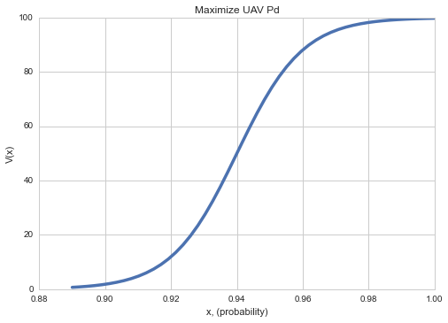

This User Guide steps through the use of the IPython Notebook available on [GitHub](https://github.com/gm4/alt-swing), an implementation of a multi-objective decision analysis trade study using the swing weight matrix.

--------

## Requirements

The [Anaconda](http://continuum.io) and [Enthought](https://www.enthought.com) Python distributions should satisfy most requirements, except [seaborn](http://stanford.edu/~mwaskom/software/seaborn/).

Python 2.7.x and the following modules:

* IPython notebook
* scipy (0.15.1)
* numpy
* pandas (0.16.1)
* matplotlib
* seaborn (0.5.1)
* markdown
* jinja2

--------

## Variables

There are a few variables that allow you to customize your trade study.  This section describes these variables and provides their default values.

The following distribution name strings correspond to the value functions.  These names should correspond to the *Family* identified in `objectives.csv` You can define your own user-defined value function by setting a unique name and name string, and adding the function definition in the code.  Be sure to include this name in the loop of the evaluation step below.

    sigString = 'sigmoid'
    linString = 'linear'
    powString = 'power'
    triString = 'triangular'

The value function range `vfRange` corresponds to the maximum value that you will use (default is 100.0).  The minimum value is alway 0.0.

    vfRange = 100.0

Weights for Importance and Swing are used to calculate the overall MODA weight of each Measure.

    impWt = 0.65
    swWt = 1.0 - impWt

By default, the program automatically generates an HTML report using the `jinja2` templating engine with markdown syntax text documents.

    htmlReport = True

If `False`, no HTML report will be generated.  Further details are in the [HTML Report](user-guide.md#Report) section.

--------

## Structuring Input

There are two input files: `objectives.csv` and `alternatives.csv`.  Both of these files are contained in the **input** folder.  Follow the recommended naming conventions to avoid refactoring the code.

The input files are contained in the `input` folder:

    - alt-swing
        alt-swing.ipynb
        - input
            - alternatives.csv
            - objectives.csv

### Objectives and Measures

The `objectives.csv` file expects the following columns and indices:

* Objective [string]: the objective corresponding to this row (index column) 
* Measure [string]: the measure corresponding to this row (index column) 
* Importance [float]:  the relative importance to the decision being assessed
* Minimum [float]: the minimum score for this Measure
* Maximum [float]: the maximum score for this Measure
* Ideal [float]: the ideal value for this measure
* Units [string]: the units of this measure (kg, m3, km/h, index, ...)
* Family [float]: the value function family for this measure; see [Value Functions](user-guide.md#ValFuncs)
* Slope [float]: +1 for an increasing function, -1 for decreasing
* Param1, Param2, Param3 [floats]: value function parameters; see [Value Functions](user-guide.md#ValFuncs)

Here is an example format:

    Objective,Measure,Importance,Minimum,Maximum,Ideal,Units,Family,Slope,Param1,Param2,Param3
    Obj1,Measure 1,35,5,50,5,lbs,sigmoid,-1,0.3,27.5,
    Obj1,Measure 2,45,10,65,10,ft3,linear,-1,,,
    Obj2,Measure 3,35,5,50,5,lbs,sigmoid,-1,0.3,27.5,


### Alternatives

The `alternatives.csv` file expects the following columns and indices:

* Alternative [string]: the name of the alternative (index column) 
* Objective [string]: name of the corresponding objective; the string should match an objective in `objectives.csv` (index column) 
* Measure [float]: name of the corresponding measure; the string should match a measure in `objectives.csv` (index column) 
* Value: the score of the alternative on this Objective/Measure; e.g. weight is 5 kg, maximum speed is 230 km/h, etc.
* Units [string]: the units associated with Value .  Note: **no unit conversion takes place**; these units should be identical to the Units defined in `objectives.csv` for the corresponding Measure.

Here is an example format:

    Alternative,Objective,Measure,Value,Units
    Cardinal,Relocate UAV,Minimize UAV weight,5,lbs
    Cardinal,Relocate UAV,Minimize UAV volume,12,ft3
    Cardinal,Employ UAV,Maximize all weather capability,3,index


--------

## Evaluating Alternatives

Each alternative is evaluated against all measures in the Objectives Hierarchy defined for the alternative.  The MODA weight is calculated using both the decision importance and the swing, or range, of alternative values of the measure.

### Value Functions <a name="ValFuncs"></a>

Value functions describe the value or utility that each alternative has with regard to the overall decision.  For all functions, x is the Score derived from the Alternative and Measure in `alternatives.csv`.  The following value functions are defined by default:

**Linear Function**

The linear function simply scales an input.

```
def scale(x, xMin, xMax):
    """ Returns the scaled value between [0.0, 1.0] evaluated at x 
    from original domain of [xMin, xMax]. """
    return (x - xMin) / (xMax - xMin)
```

`xMin` : objectives.Minimum, `xMax` : objectives.Maximum; (Minimum and Maximum defined in `objectives.csv`).

**Bell Function**

```
def bell(x, a, b, c):
    """ Returns the [0,vfRange] scaled generalized bell curve 
    evaluated at x for (c)enter and shape parameters a and b."""
    return vfRange * 1.0 / (1.0 + pow(np.abs((x - c)/a), (2.0*b)))
```

`c` : Param1, `a` : Param2, `b` : Param3

**Sigmoid Function**

```
def sigmoid(x, a, c):
    """Returns the [0,vfRange] scaled sigmoid function evaluated 
    at x for (a)lpha and (c)enter."""
    return vfRange * (1.0 / (1.0 + np.exp(-1.0 * a * (x - c))))
```

`a` : Param1, `c` : Param2, Param3 is unused

**Triangular Function**

```
def triangular(x, l, c, r):
    """ Returns the [0,100] scaled triangular value function evaluated 
    at x for (l)eft, (c)enter, (r)ight triangular parameters."""
    return vfRange * max(min(((x - l)/(c - l)), ((r - x)/(r - c))), 0.0)
```

`l` : objectives.Minimum, `r` : objectives.Maximum, `c` : objectives.Ideal; Minimum, Maximum and Ideal are defined in `objectives.csv`.

###

Here is an example value function for a single measure.

<!-- $(x - x_l)/(x_m - x_l)$
 -->

<!--  -->

--------

## Calculating Weights 

The overall value of each alternative depends on the swing weight, which is calculated as a function of the degree of importance and the range of alternative value.(refer to the SEBoK Wiki page on [Decision Management](http://sebokwiki.org/wiki/Decision_Management) for more information).  The evaluation of each alternative is done using built-in `numpy` or `pandas` functions and transformations.  See the [scipy](http://docs.scipy.org/doc/scipy/reference/) or [pandas](http://pandas.pydata.org/pandas-docs/stable/) documentation for more information.  The logic for this evaluation is as follows:

The evaluation operation loops through all rows of the alternatives DataFrame defined from `alternatives.csv`, and evaluates the alternative for the corresponding Objective and Measure, which are index columns of the objectives DataFrame.  The parameters for these dictate the function family, minimum, maximum and other parameters of the value function.  The resulting score, or unweighted value, is stored in the alternatives DataFrame.  The loop ends after the last row of the alternatives DataFrame has been evaluated.

### Calculating Swing Weights

Calculated as the range (max - min) of all alternative value scores, then normalized.  Refer to the [SEBoK Wiki](http://sebokwiki.org/wiki/Decision_Management) for more details.

### Calculating MODA Weight

A combination of Measure's *Importance* and *Swing* weights using the variables `impWt` and `swWt` defined above.  Refer to the [SEBoK Wiki](http://sebokwiki.org/wiki/Decision_Management) for more details.

### Generating the Alternative Value Matrix

The MODA results are used to compare alternative performance against the objectives and measures.

Uses **seaborn**'s `heatmap` function.  Here is an example heatmap that gets generated.


----


## Generating Reports <a name="Report"></a>

Standalone HTML reports are generated automatically using the `jinja2` templating engine and `markdown` Python module.  The directory structure for this environment is:

    - alt-swing
        - templates
            - content
                - alternatives-section.md
                - obj_measures-section.md
                - xxx-section.md
            - alt-swing_template.html
        - html_report
            - css
                - ...
            - images
            - report.html
        

The **templates** folder contains the input necessary to generate the report.  This includes the **alt-swing_template.html** `jinja2` HTML template.  The **content** subfolder includes markdown documents where you can place your desired report content.  You can modify the template to add new content sections as you need, but it will require modifying the `alt-swing` content as well, since there are direct pointers to the specific files above.  These files are converted to HTML using the `markdown` module.

The **html_report** folder contains (you guessed it!) the generated report.  Open the **report.html** file in a browser to view the results.  The default `alt-swing` report template includes transformed versions of the alternatives and objectives and measures DataFrames, along with a few selected figures.

### Creating the Report in Other Formats

Once you have the HTML report, consider using [pandoc](http://pandoc.org), free software that can convert to other formats, including MS Word and PDF (via LaTeX).

## To do

Please see the [alt-swing GitHub]() page for information on future updates.